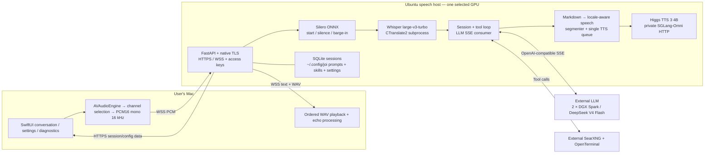

# Architecture

Joi is a network application, not a browser UI around models on the Mac.
The macOS client and Ubuntu backend have independent filesystems and lifecycles.
An independently deployed LLM exposes OpenAI-compatible Chat Completions.

## Process boundaries

- **Client:** UI and microphone permissions, local capture diagnostics, WebSocket
  transport, REST management and playback. No model weights or backend shell.
- **Backend service:** session state, VAD, STT orchestration, prompts/skills, tool
  calls, LLM streaming and speech queue. It owns the public TLS listener.
- **STT child:** CTranslate2 owns its CUDA libraries in a spawned subprocess.
- **TTS service:** separate Python/PyTorch environment, loopback-only port 8790.
  Only this service loads Higgs. Model execution is serialized by the backend
  worker and shared synthesis lock.
- **External tools:** OpenTerminal is the only arbitrary command/file sandbox.
  The gateway's bounded skill importer is not a general local shell.
- **External LLM:** never installed, restarted or reconfigured by the installer.

The development speech host has three RTX 3090 cards. GPU 0/1 run Qwen/vLLM;
Joi uses physical GPU 2 and coexists with ComfyUI. The installer defaults to 2
but accepts one explicitly selected physical GPU for other deployments. It
never evicts another process. Inside the restricted CUDA namespace, STT uses
logical device 0. GPU selection is installation-only, not remotely editable.

## Concurrency and ownership

A WebSocket owns a live conversation runtime; SQLite owns persistent messages.
A response has a unique ID and cancellation scope. LLM text forwarding must
not wait for TTS. One ordered synthesis worker consumes bounded segment queues.
Assistant text completion is distinct from audio completion and local playback
drain. Marker and binary WAV writes share a send lock.

Tool results are retained in model context; public tool lifecycle data is
separate. Cancellation stops the spoken response, not arbitrary already-running
OpenTerminal processes. See [protocol](PROTOCOL.md).

## Sources of truth

| Concern | Source |
| --- | --- |
| Release identity | root VERSION + generated release.json |
| Backend settings and model profiles | ~/.config/joi/backend/*.json |
| Client preferences | ~/.config/joi/client/settings.json on the Mac |
| Access secrets | backend secret files / macOS Keychain |
| Skill catalog and bodies | ~/.config/joi/skills/manifest.json and slug/SKILL.md |
| Main instruction | ~/.config/joi/prompts/default-system.md |
| Persistent history | ~/.local/share/joi/sessions.sqlite3 |
| Download provenance | installer/models.json + installed model receipts |

Release source is immutable after installation. Mutable configuration and data
must not be written into it. See [configuration](CONFIGURATION.md).
